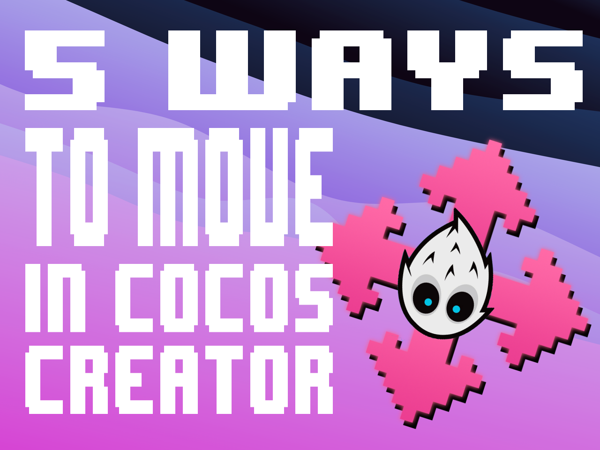

# Five ways to move an element in Cocos Creator

One of the first things you'll want to do for your game is probably to move a sprite, an object, from point A to point B. There are various ways to move an element in Cocos Creator, some affect the `ridigBody` and the others on the position of the `Node`, let's see them together:

## 1. Position

Changing the position of an element is probably the first solution, just assign a new position to the `Node`. The position is relative to the parent `Node`. Using position is like teleporting the element to a new position so it's not affected by the `RigidBody` or the `Physics` of the game. Strange things can happen if you use position and physics together (for instance partial or no collisions). You can use `setPosition` or `setWorldPosition` to set the position of the `Node`.

```ts
    const newPosition = this.node.getPosition();
    this.node.setPosition(new Vec3(newPosition.x + 10, newPosition.y + 10));
```

## 2. Translation

Similar to position, but perform a translation instead of a teleport. The translation is relative to the parent `Node`. You can use a second parameter `nodeSpace` to set the coordinate space `WORLD` or `LOCAL`.

```ts
    this.node.translate(new Vec3(ammount, 0), NodeSpace.WORLD);
```

## 3. Force

The force is applied to the `RigidBody` of the element. You can use `applyForceToCenter` or `applyForce` to apply the force to the center of the `RigidBody` or to a specific point. This is a literal pushing motion where the bigger the mass of the Object, the slower it will speed up. You can use a second parameter `wake` to wake up the `RigidBody` if it's sleeping. Force Add a continuous force to the rigidbody, using its mass.

```ts
    this.rigidBody.applyForceToCenter(new Vec2(ammount, 0), true);
```

## 4. Impulse

The impulse is applied to the `RigidBody` of the element. You can use `applyLinearImpulseToCenter` or `applyLinearImpulse` to apply the impulse to the center of the `RigidBody` or to a specific point. You can use a second parameter `wake` to wake up the `RigidBody` if it's sleeping. Impulse Add an instant force impulse to the rigidbody, using its mass.

```ts
    this.rigidBody.applyLinearImpulseToCenter(new Vec2(ammount, 0), true);

```

## 5. Velocity

The velocity is applied to the `RigidBody` of the element. You can use `linearVelocity` to set the velocity of the `RigidBody`. You can use a second parameter `wake` to wake up the `RigidBody` if it's sleeping.

```ts
    this.rigidBody.linearVelocity = new Vec2(velocity.x - ammount, velocity.y);
```


