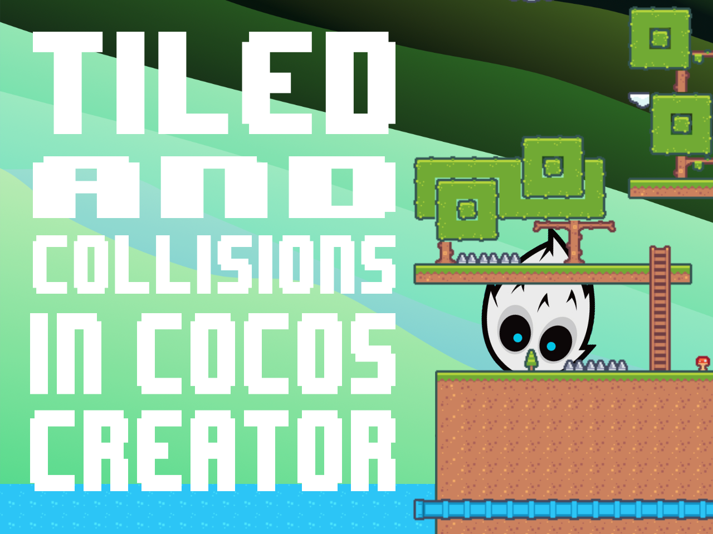
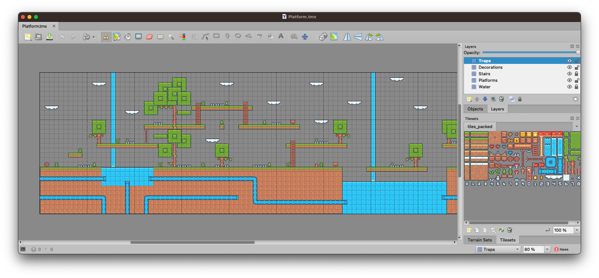
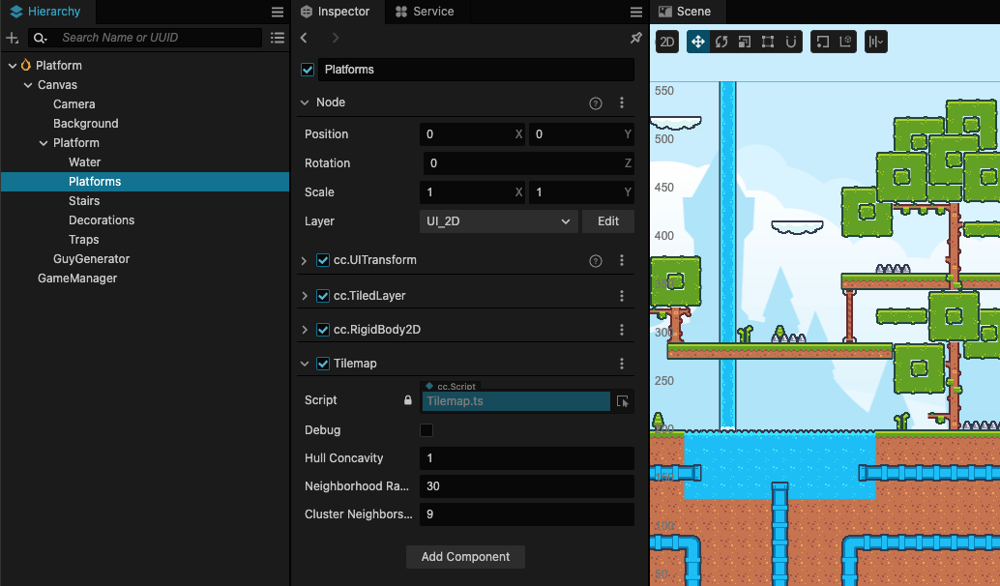
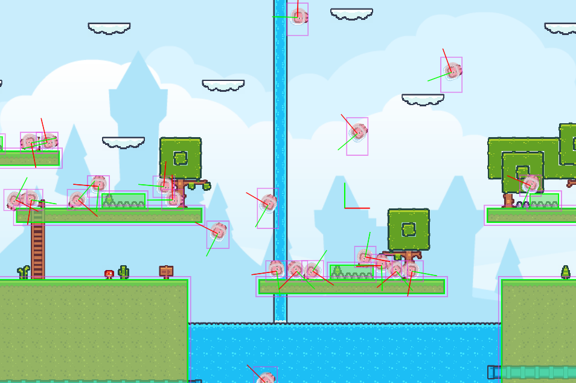

# Tiled and collisions in Cocos Creator

### If you've tried to figure out how to use collisions with Tiled tiledmaps and Cocos Creator probably you had no luck. This is because out of the box this configuration is unsupported. But there is a way to make it work.

## TLDR

You can find all the code in this [repository][0]

## How it works ?

The [`Tiledmap.js`][1] component can be applied on any `TiledLayer` node which are sub-layers of a `TiledMap`. The script uses [`Hull.js`][2] and [`DBSCAN`][3] to generate the collision shapes from the cloud of points of the coordinates of the tiles of that node and apply a `PolygonCollider2D` for every cluster of points.

The component has four parameters: 

1. **Debug**: if true it will draw the collision shapes in the scene.
2. **Hull Concavity**: the concavity of the hull, the higher the value the more concave the hull will be. You can leave it at 1.0.
3. **Neighbour Radius**: the radius of the circle that will be used to find the neighbours of a point.
4. **Cluster Neighbours** Points: the number of neighbours that a point must have to be considered a cluster.

You may need to tweak parameters 3 and 4 to get the best results.

## Example

This is an example of a tiledmap with collisions. I've created 5 different layers, I want to apply rigidbodies only to the platforms and traps. The other layers are just decorations and I don't want to apply any rigidbody to them.



```
Tiled layers
├─ Traps
├─ Decorations
├─ Stairs
├─ Platforms
└─ Water
```

I Cocos Creator I've just added the `TiledMap` and the `RigidBody` components to the layers I wanted to apply collisions to. Remember to set the rigidbody type to `Static` if you use gravity or the layer will fall.



And voilà, as you can see the `PolygonCollider` is generated automatically from the tiles of the layer.



::: tip
I've found some glitches with the TiledMap when scrolling, some layers were not drawn correctly. I've fixed it by adding a rigidbody to the `TiledMap`.
:::

::: warning
`TiledMap` can't really work on _borders_, for instance if you need to have a frame-like borders you need to create 4 different layers and apply the `TiledMap` component to each of them. If not Hull.js will consider them as a whole and will generate a single collision shape for the whole border.

```
  ┌─────────┐         ──────────
  │         │       │            │
  │         │       │            │
  │         │   =>  │            │
  │         │       │            │
  │         │       │            │
  └─────────┘         ───────────
```
:::

# Demo

<div class="game-iframe">
   <iframe src="/games/tiled-collisions/index.html" title="laser defender" width="600" height="400" frameborder="0"></iframe>
</div>

[0]: https://github.com/theRenard/cocos-creator-tiled-collider-creator
[1]: https://github.com/theRenard/cocos-creator-tiled-collider-creator/blob/master/assets/Scripts/Tilemap.ts
[2]: https://github.com/AndriiHeonia/hull
[3]: https://github.com/uhho/density-clustering
