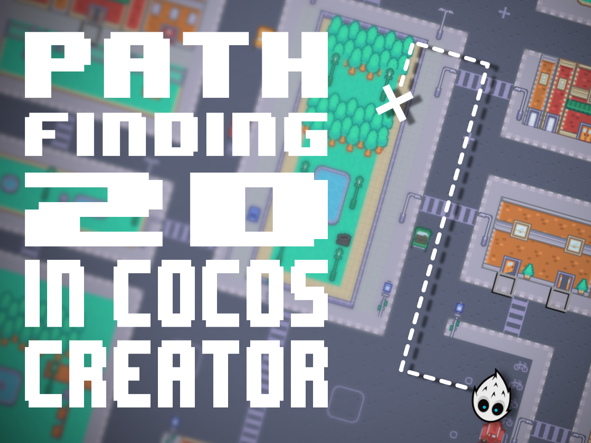
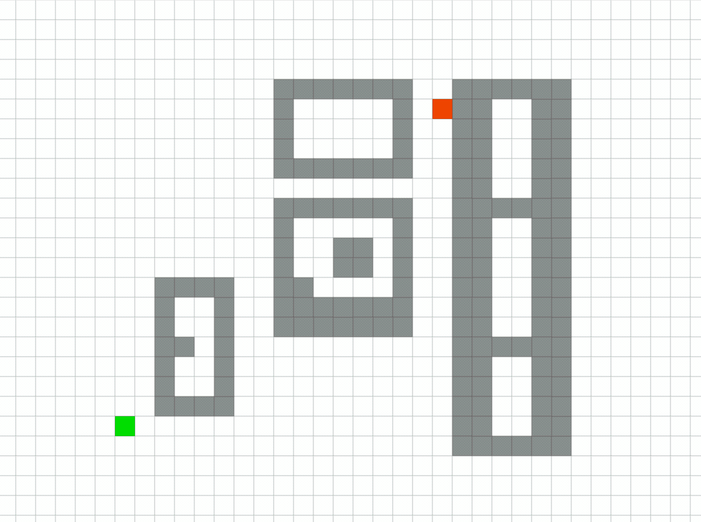

# Pathfinding 2D in Cocos Creator

### Pathfinding is a common feature in games. In this tutorial, we will show you how to implement a pathfinding system in Cocos Creator to move a swarm of enemies toward the player

## What is Pathfinding?

Pathfinding is a common feature in games. It is used to find a path between two points in a game world. The pathfinding system is used to make the game characters move from one point to another. It is also used to make the game characters avoid obstacles and other characters. It is used in many games, such as strategy games, role-playing games, and action games. In this tutorial, we will show you how to implement a pathfinding system in Cocos Creator. We will use the A* algorithm (one of the fastest) to find the shortest path between two points and avoid obstacles.
In this picture, you can see the pathfinding system in action. The green square is the starting point (the enemy). The red square is the destination point (the player). There are obstacles like walls or buildings. The yellow line is the path found by the pathfinding system. The enemy character will follow this path to reach the player. 

We will use [Pathfinding.js][1] to implement the pathfinding system. Pathfinding.js is a JavaScript library that implements the A* algorithm (and many others). It is very easy to use and well-documented. 

## TL;DR

You can find all the code in this [repository][0]

## Demo

You can use the arrow keys to move.

   <iframe src="/games/path-finding/index.html" title="pathfinding" frameborder="0" style="aspect-ratio: 1 / 1"></iframe>

[0]: https://github.com/theRenard/cocos-creator-2d-pathfind
[1]: https://github.com/qiao/PathFinding.js
