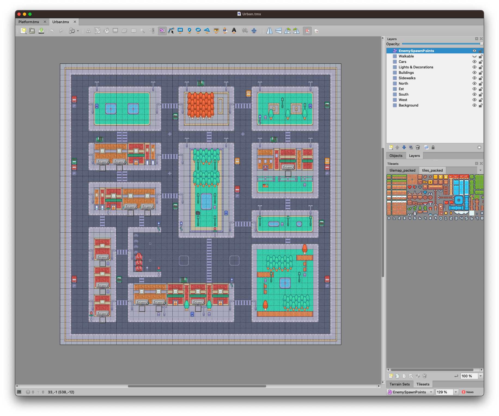
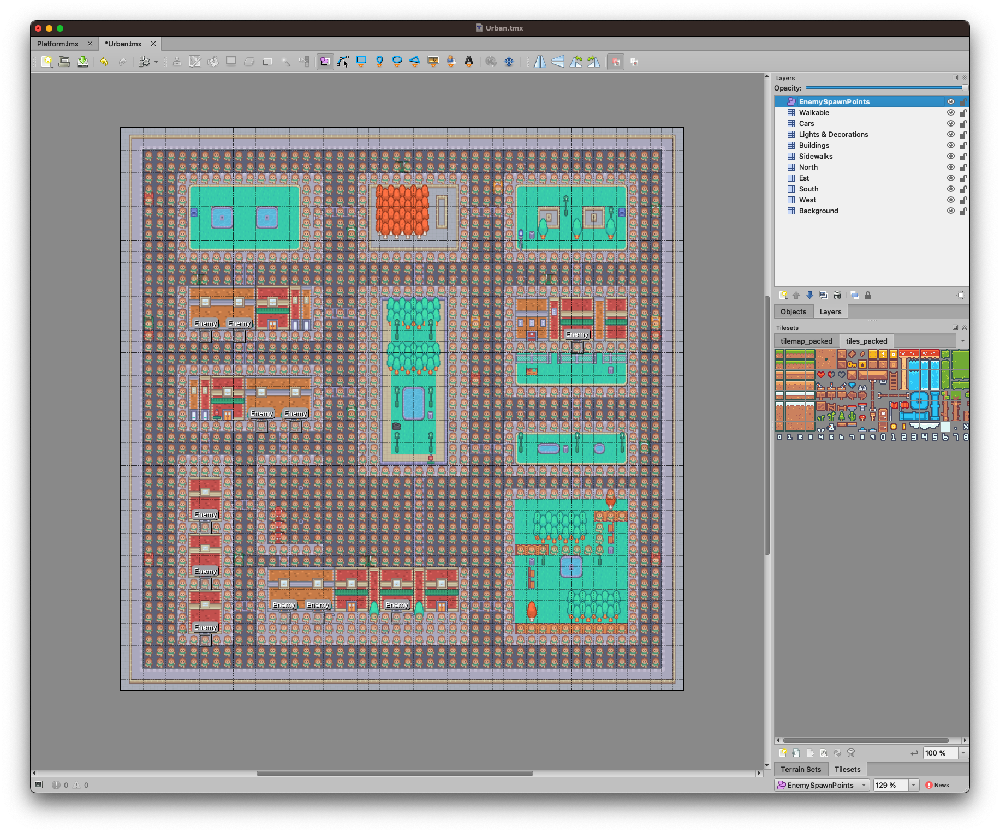
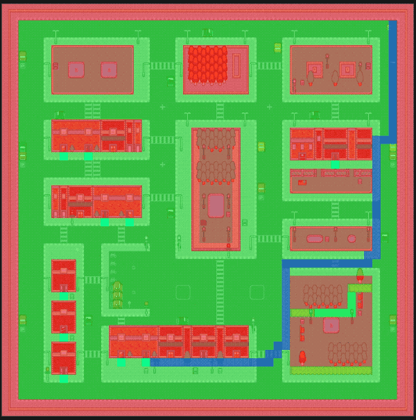

# Tiled

A [Tiled][1] map could be a perfect candidate for our project and Cocos Creator has built-in support for it. After all, tiles are the perfect way to create a grid of nodes, in this map, there are just 50 * 50 tiles, so our matrix will be 50 * 50 nodes.

```
Tiled layers
├─ EnemySpawnPoints [object layer]
├─ Walkable [invisible layer]
├─ Cars
├─ Lights & Decorations
├─ Buildings
├─ Sidewalks
├─ North
├─ Est
├─ South
├─ West
└─ Background
```



We need `EnemySpawnPoints` layer to get the coordinates of spawning areas, and the `Walkable` layer to get walkable tiles.




Now we need to create a script that will create the matrix of nodes and populate it with the data from the `Walkable` layer. We will call this script `PathFinding` and we will add it to the `Enemy` prefab.

## The `Pathfinding` component

The first thing to do is to get the correct size of the tiled map. We will need it to convert tiles coordinates to pixel world coordinates.

```ts
  private _getLayerSize() {
    const uitransform = this._tiledLayerWalkableNode.getComponent(UITransform);
    this._tiledLayerBoundingBox = uitransform.getBoundingBox();
  }
```

Next, we need to get the size of a tile in pixels (for this project they are 16x16 pixels)

```ts
  private _getTileSize() {
    const { width: height } = this._tiledLayer.getMapTileSize();
    this._tileWidth = height;
    this._tileHeight = height;
  }
```

And the size of the layer in tiles (50x50 for this project)

```ts
  private _getTileLayerSize() {
    const { width, height } = this._tiledLayer.getLayerSize();
    this._matrixWidth = width;
    this._matrixHeight = height;
  }
```

Then we will create the matrix of nodes, as said we will assume that every node is an obstacle.

```ts
  private _createMatrix() {
    this._matrix = Array(this._matrixHeight).fill(BLOCKED).map(() => Array(this._matrixWidth).fill(BLOCKED));
  }
```

And we will iterate through the `Walkable` layer and check if at a given coordinates a tile exists, in this case, we set it as _walkable_.

```ts
  private _populateMatrixFromVerticesData() {
    const { vertices } = this._tiledLayer;
    // fill the matrix with the vertices
    for (let row = 0; row < vertices.length; row++) {
      if (vertices[row] !== undefined) {
        const cols = Object.keys(vertices[row])
          .map((key) => parseInt(key))
          .filter((predicate) => !Number.isNaN(predicate));
        for (const col of cols) {
          this._matrix[row][col] = WALKABLE;
        }
      }
    }
  }
```

Finally, we create the `Pathfinding.js` grid

```ts
  private _createGrid() {
    this._grid = new PF.Grid(this._matrix);
  }
```

That's all. Now we can add this script to the `Enemy` prefab so that the enemy will be able to find the path to the player. This script exposes a public method that returns the coordinates as `Vec3` of the next point the enemy should walk to.

```ts
  public getNextPosition() {
    this._createPath();
    if (this.debug) {
      this.debugGraphic.clear();
      this._createMatrixDebug();
      this._createPathDebug();
    }
    const nextPosition = this._path[1];
    if (nextPosition) {
      const [x, y] = nextPosition;
      const position = this._convertMatrixPositionToPosition([x, y], true);
      return position;
    } else {
      console.log("no path");
      return null;
    }
  }
```

## The `Enemy` prefab

The `Enemy` prefab is a simple sprite with a `PathFinding` component. It has a `startMove` method that will:

1. Get the next position from the `PathFinding` component
2. Move to that position with a `tween` action
3. Repeat when the tween is completed

```ts

  _startMove() {
    const position = this._pathFinding.getNextPosition();
    if (position !== null) {
      this._tween = tween(this.node).to(this.moveDuration, { position }, {
        onStart: () => {
          this._setDirection(this.node.getPosition(), position);
          this._animate();
        },
        onComplete: () => {
          this._startMove();
          this._animate();
        },
      }).start();
    }
  }

```

Here you can see how the enemy moves from the spawning point toward the player. The script has a `debug` property that will draw the path and the matrix on the screen.

{.center}


[1]: https://www.mapeditor.org/
[2]: https://github.com/theRenard/cocos-creator-2d-pathfind/blob/master/assets/Scripts/PathFinding.ts