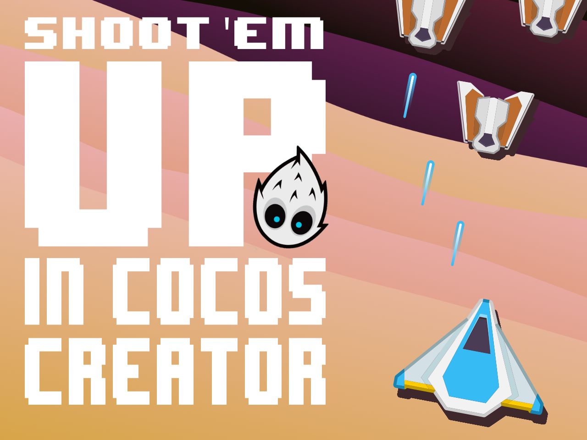

# Shoot 'em up in Cocos Creator

### Developing a simple game like a Shoot 'Em Up in Cocos Creator is not hard, but if you are new to this engine you may have a hard time understanding how to do it. In this article, I'll try to explain the logic behind the code of a simple Shoot 'Em UP and how the different pieces work togheter.

<iframe class="game-iframe" src="/games/laser-defender/index.html" title="laser defender" width="450" height="800" frameborder="0"></iframe>

## :warning: Disclaimer

I will not describe the code line by line for two reasons: 
   1. I assume you have a basic knowledge of Cocos Creator engine and its API but if this is not the case I strongly suggest to start reading the [official documentation](https://docs.cocos.com/creator/manual/en/) and come back here once you have a basic grasp of it. 
   2. I also assume that you know how to code. The game's code is pretty simple and straighforward, also the components are really small. If you don't know how to code maybe a game is not the first thing you wanna do... even though it's a great way to learn.
   
I will instead describe the logic behind the code and how the different scenes, node and components work togheter.

Laser Defender is a game I've learned thanks to this [Udemy course](https://www.udemy.com/course/unitycourse/). I've decided to port it to Cocos Creator to see how it works and to compare it with Unity. I've used Cocos Creator 3.6.2.

Another thing, I'm not a game developer, I'm a web developer, so I'm sure there are better ways to do this, but this is how I did it.

All assets are from [Kenney](https://kenney.nl/assets)! Really great work!

If you want to follow along, you can download the project from [github](https://github.com/theRenard/cocos-creator-laser-defender) and start reading.

## The `Assets` folder

With time you will find that the `Assets` folder will become a mess, so I suggest to organize it in a way that makes sense to you. I've used the following structure:

```
Assets
├─ Textures
│  └─ 🖼️
├─ Fonts
│  └─ 🖼️
├─ Music
│  └─ 🎹
├─ Particles
│  └─ 💥
├─ Prefabs
│  ├─ Effects
│  ├─ Enemies
│  ├─ Particles
│  ├─ Paths
│  ├─ Projectiles
│  └─ Waves
├─ Scenes
│  └─ 🎬
├─ Scripts
│  └─ xxx.ts
└─ Sounds
   └─ 🔔
```

::: tip 
I had a lot of issues with system fonts so I've finally used a bitmap one. I've used [bmGlyph](https://www.bmglyph.com), which is a great app that does plenty of things like gradient and other effects.
:::

::: warning
Save your time and just use `mp3` files for music and sound effects, `ogg` files are not supported in some browsers.
:::

## The `Scenes`

First thing first, the game is composed of 4 scenes. The `Preload` scene is where the game starts it loads immediatly the `MainMenu` scene that is the first scene that is shown to the player when the game is launched. The `Game` scene is the main scene, where the game is played. The `GameOver` scene is shown when the player loses.

```
Scenes
├─ Preload
├─ MainMenu
├─ Game
└─ GameOver
```

::: tip
You set the game starting scene not in preferences but during the build phase so that you can, for instance, start with a different scene according to the target platform.
:::

## The `Preload` Scene

The `Preload` scene is used to instantiate two [singletons](https://refactoring.guru/design-patterns/singleton). One is for managing levels and the other to play the game music. Singletons are used to share data between scenes. This tecnique is also used in [Unity](https://gamedevbeginner.com/singletons-in-unity-the-right-way/).

/// add the singletons

## The `Game` Scene Hierarchy

The game scene hieararchy is very simple, there's a `Canvas`, a `Camera`, a `Player` node of course, scrolling `Background` / `Foreground` nodes and `Enemies` prefabs that are instantiated that move towards the player. The player can shoot `Projectiles` that destroy enemies. The game is over when the player's health is over. The UI is composed of a `ProgressBar` and a `Score`. There is also a `GameManager` node that hosts the script that manages the game as the `EnemySpawner` and the `ScoreKeeper`. We will see how these work in the next sections. You will also notice a parent node for the `Player` which is `ShipBoundaries`. It's used to limit the player's movement inside the canvas and it uses the `Widget` component to stick to the canvas (even if the game is not responsive).

```
Game
└─ Canvas
   ├─ Camera
   │
   ├─ Background
   │  ├─ Stars
   │  └─ Clouds
   │
   ├─ ShipBoundaries
   │  └─ Player
   │     ├─ Engine
   │     └─ Ship
   │
   ├─ Foreground
   │  └─ Clouds
   │
   ├─ UI
   │  ├─ ProgressBar
   │  │  └─ Bar
   │  └─ Score
   │
   └─ GameManager

```

## The `Camera` node

The camera node is a child of the `Canvas` node, it's used to follow the player. The script attached to the camera is [`CameraShake.ts`](https://github.com/theRenard/cocos-creator-laser-defender/blob/master/assets/Scripts/CameraShake.ts) and it does exactly what it says, it shakes the camera. It's used when the player is hit by an enemy. The script is very simple, it just moves the camera in a random direction for a given amount of time. The camera is moved by changing the `position` and the `rotation` property of the node. 


## `Background` and `Foreground` Nodes

These two nodes are placeholder for textures, the `Background` node has `Stars` and `Clouds` textures, those nodes are just sprites with a script attached. The script is [`Scroller.ts`](https://github.com/theRenard/cocos-creator-laser-defender/blob/master/assets/Scripts/Scroller.ts) and it does just one thing, it scrolls the texture. How ? It clones the node so that it can scroll infinitely. The two nodes forms a column that begin to scroll at a given speed, when the bottom one reaches the end of the canvas (and it is out of sight) it moves at the top of the other and the process repeats. This is how the scrolling effect is achieved.

## The `Player` Node

The `Player` node is the most complex node in the game, it has a lot of scripts attached to it, so it deserves a [section of its own](/articles/cocos-creator/shoot-em-up-in-cocos-creator/the_player). 