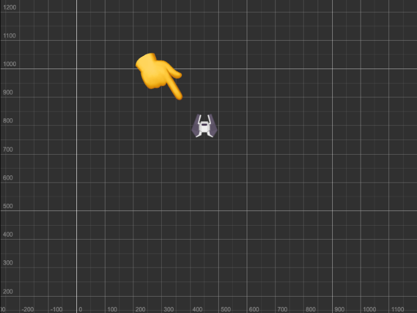
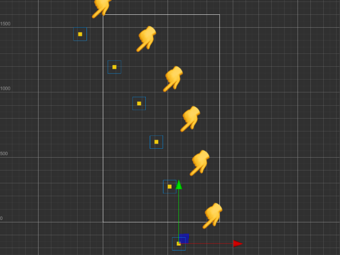
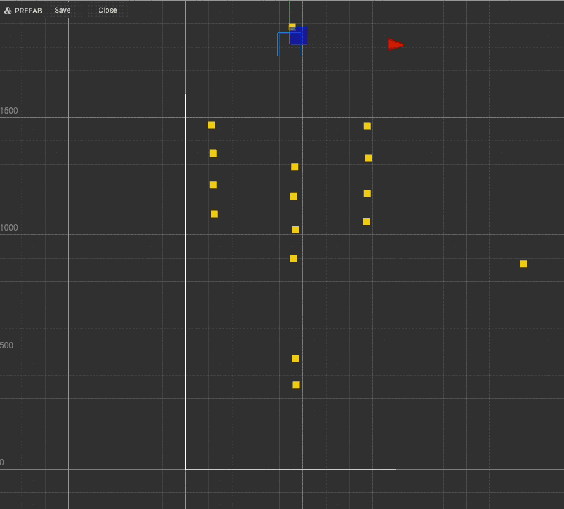

## The `EnemySpawner` component

The [`EnemySpawner.ts`](https://github.com/theRenard/cocos-creator-laser-defender/blob/master/assets/Scripts/EnemySpawner.ts) is responsible for spawning enemies. It can loop through an array of `Waves` of enemies. When the scene starts the script creates a generator that yields all the waves. The wave instantiates the enemies and then after a given ammount of time it instantiate the next one. 

## The `Wave`prefab

The `Wave` prefab is a container for the enemies. It contains just one component, `WaveConfig`, the script that instantiates the enemies and that let them follow a given path in the scene. The `WaveConfig` script accepts an array of prefab of enemies and one `Path` prefab (plus some other fancy time paramters).

## The `WaveConfig` component

The [`WaveConfig.ts`](https://github.com/theRenard/cocos-creator-laser-defender/blob/master/assets/Scripts/WaveConfig.ts) script handles the instantiation of the enemies (like `EnemySpawner` does for waves, but this time the prefab is an `Enemy` node). It accepts and array of `Enemy` so that you can have different enemies in the same wave. It also accepts a `Path` prefab, so that every wave can have its own path. It's time now to see how the `Enemy` prefab works.

## The `Enemy` prefab

The Enemy prefab has 8 components, 3 of them are built-in components, the others are custom scripts. It is very similar to the `Player` node and we already discussed about most of its components. It doesn't have `PlayerController` script but it has `Enemy` and `Score` components. 

```
Enemy
├─ cc.UITransform
├─ cc.CircleCollider2D
├─ cc.RigidBody2D
├─ Enemy.ts
├─ Health.ts
├─ DamageDealer.ts
├─ Shooter.ts
└─ Score.ts
```


## The `Enemy` component

The [`Enemy.ts`](https://github.com/theRenard/cocos-creator-laser-defender/blob/master/assets/Scripts/Enemy.ts) script is responsible for the enemy movement. It has the `followPath` method that iterates through some waypoins (waypoints are in the `Path` prefab but we'll get to that later) and it uses the `cc.tween` API to move the enemy from one waypoint to the next. When the enemy reaches the last waypoint which is outside of the camera boundaries it is destroyed.

## The `Score` component

The [`Score.ts`](https://github.com/theRenard/cocos-creator-laser-defender/blob/master/assets/Scripts/Score.ts) script is responsible for adding points to the score when the enemy is destroyed. It has a `score` property that is set in the inspector. When the enemy is destroyed the `ScoreKeeper` component is notified and the score is updated.

## The `Path` prefab

The `Path` prefab is a container for the waypoints. Waypoints are just regular nodes positioned in the scene. The `Enemy` component uses the `Path` component (it gets it from its parent, the `Wave` prefab) to follow the waypoints, giving the illusion of a path. 

```
Path
├─ Waypoint-001
├─ Waypoint-002
├─ Waypoint-003
├─ Waypoint-004
├─ Waypoint-005
├─ Waypoint-006
├─ Waypoint-007
└─ Waypoint-008
```



Paths can be very complex like the one in the image below that is used for the boss.

