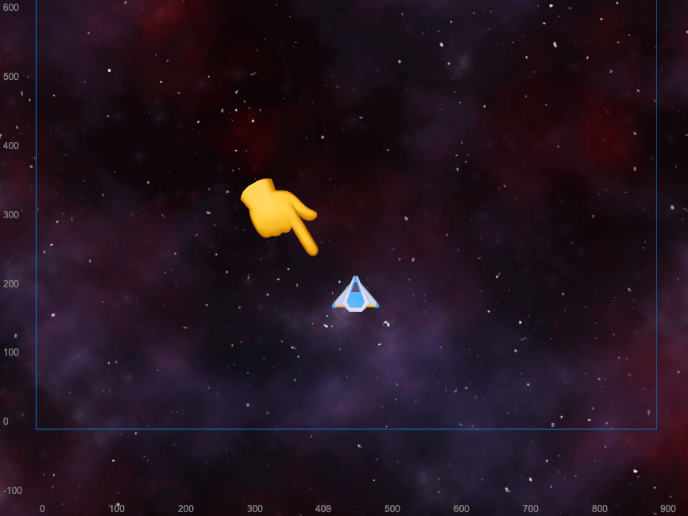

# The Player Node

### The Player Node is the main character of the game, it's a spaceship that can move and shoot lasers. It contains a lot of components, but we will see them one by one.

## The `Player` Children Nodes

The Player has 2 children nodes, the `Engine`, which is a particle system, and the `Ship` which is a sprite. I've found that in many tutorials the player node contains the sprite component, but I think it's better to use a sprite as a child of a node, so you can add other components (sprite or particles) to the player node. 

```
Player
├─ Engine
└─ Ship
```

## The Components

The Player Node has 10 components, 3 of them are built-in components, the others are custom scripts. We will see them one by one.

```
Player
├─ cc.UITransform
├─ cc.CircleCollider2D
├─ cc.RigidBody2D
├─ Player.ts
├─ PlayerInput.ts
├─ Health.ts
├─ DamageDealer.ts
├─ Shooter.ts
└─ FireHomingMissile.ts
```




## The built-in Components

`cc.UITransform` is a built-in component that allows you to position the node in the UI. It's not necessary for the player, but it's useful to see the position of the node in the editor. `cc.CircleCollider2D` is a built-in component that allows you to add a circle collider to the node. A circle in this case is better to handle the shape of the ship. `cc.RigidBody2D` is a built-in component that allows you to add a rigid body to the node, as there's no physic involved in this game we use it only to detect collisions.

## The `Player` component

The [`Player.ts`](https://github.com/theRenard/cocos-creator-laser-defender/blob/master/assets/Scripts/Player.ts) script handles the player position, it respect the boundaries of the parent node with the `math.clamp` utility. the `move` method is called in the `update` method and it take into account both `deltatime` ([why?](https://drewcampbell92.medium.com/understanding-delta-time-b53bf4781a03)) and `movespeed` variables. It exposes also the `onMove` and `onFire` methods that are called by the `PlayerInput.ts` script.


## The `PlayerInput` component

The [`PlayerInput.ts`](https://github.com/theRenard/cocos-creator-laser-defender/blob/master/assets/Scripts/PlayerInput.ts) script handles the player input, it's a very simple script that uses the `input.on` method for events `KEY_DOWN`, `KEY_DOWN` and `GAMEPAD_INPUT`. When the event occurs it calls the `onMove` or `onFire` methods of the `Player.ts` class. It handles also the deadzone of the gamepad to avoid drift.

## The `Health` component

The [`Health.ts`](https://github.com/theRenard/cocos-creator-laser-defender/blob/master/assets/Scripts/Health.ts) script handles the health of the player or of the enemies. It handles multiple things, let me explain them one by one:

  - It uses the `boxCollider` of the node to know when the player is hit by something (a bullet or an enemy for the player), when this event occours it calls the `onBeginContact` method to get the `damageDealer` (`DamageDealer.ts`) component from the other collider and subtracts the damage value of the latter from the health property. If the health is less than half it plays the smoke effect, if is less or 0 it destroys the node with `die` method.
  - It handles the smoking, hit and explosion particle effect, it instantiates them (they are prefabs) and plays them when needed.
  - It handles the player health property with some methods, like `getHealth`, `setHealth`, `fillHealth`. 
  - It handles the camera shake.
  - It adds the score when the node has the `Score` component (the enemies have it).

::: warning
For some reasons the `destroy` method is asynchronous and it can be called on a destroyed node, even if you check if is valid it can fail. The soultion is to use the next loop with `setTimeout` to avoid this problem.
:::

## The `DamageDealer` component

The [`DamageDealer.ts`](https://github.com/theRenard/cocos-creator-laser-defender/blob/master/assets/Scripts/DamageDealer.ts) script handles the damage of the player or of the enemies. It's a very simple script that exposes the `damage` property with `getDamage` method. It has also the `hit` method that is called for the bullets (they don't have any health and just get destroyed).

## The `Shooter` component

The [`Shooter.ts`](https://github.com/theRenard/cocos-creator-laser-defender/blob/master/assets/Scripts/Shooter.ts) script, like the `Health.ts` script is used by the player and the enemies. It handles the shooting, it instantiates the bullet prefab. Every enemmy has a different shooting pattern, so the `Shooter.ts` script is used to handle the shooting of the player and the enemies. An enemy can have a different firing rate and a different kind of projectile.

## The `FireHomingMissile` component

The [`FireHomingMissile.ts`](https://github.com/theRenard/cocos-creator-laser-defender/blob/master/assets/Scripts/FireHomingMissile.ts) handles the homing missile, it just instantiate the missile prefab, all the missile logic is in the prefab itself.

## The `GameManager` node

The `GameManager` node is a node that contains all the game logic, it's responsible for the spawning of the enemies, and the score. Let's take a look at the component in the [next section](/articles/cocos-creator/shoot-em-up-in-cocos-creator/the_game_manager).

