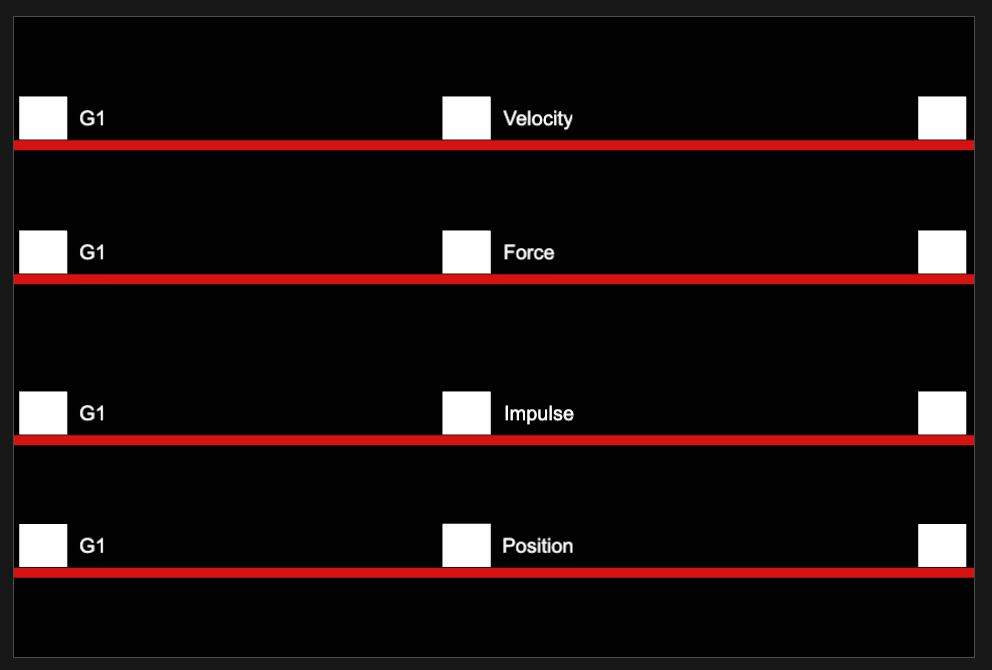

# Cinque modi di muovere un elemento in Cocos Creator



Una delle prime cose che avrete voglia di fare per il vostro gioco è probabilmente di muovere uno sprite, un oggetto da un punto A ad un punto B. Esistono vari modi di muovere un elemento in Cocos Creator, alcuni agiscono sul `ridigBody` e gli altri sulla posizione del `Node`, vediamoli insieme:

## 1. Posizione

Modificare la posizione di un elemento è probabilmente la prima soluzione, basta assegnare una nuova posizione al `Node`.

```ts
    const ammount = 10;
    const position = this.node.getPosition();
    this.node.setPosition(new Vec3(position.x + ammount, position.y)); 
```

## 2. Translazione

Simile alla posizione ma

```ts
    this.node.translate(new Vec3(ammount, 0), this.worldPosition);
```

## 3. Impulso

```ts
    this.rigidBody.applyLinearImpulseToCenter(new Vec2(ammount, 0), true);

```

## 4. Forza

```ts
    this.rigidBody.applyForceToCenter(new Vec2(ammount, 0), true);
```

## 5. Velocità

```ts
    this.rigidBody.linearVelocity = new Vec2(velocity.x - ammount, velocity.y);
```

## Fronde vestras pomi

Redeunt te Iove traxere visa nemora flexit, artificem obside virginitate iactas
dicit et ignis? Ardua ergo, sequenti in erat cinximus,
[et](http://pro.org/solvit-in) Meropis [nobilis multis](http://nervisdeum.com/),
viri sum resistit!

1. Desuetudine lugebat arceor pietasque a pondere tenet
2. Ratis mihi iubar robora fallique te Troiam
3. Mediis laudem in sonanti passibus nec arma
4. Non disces multi totis sapiente
5. Totiens non modo tristis factus dissipat est

Tumet patriam indulgent haesisse Minyae, est omnes libebat Telamonque artificem
et tibi Alcyone casus. Fluctus nunc vigiles madefacta deriguere quem.